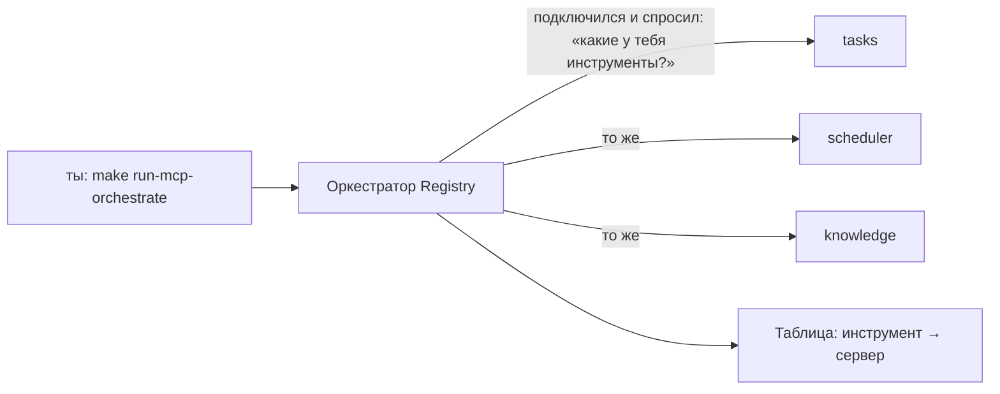

# Оркестрация нескольких MCP-серверов — простое объяснение

Как устроен оркестратор в модуле `agent/`, как им пользоваться и что делать,
если что-то не работает.

---

## 1. Термины

| Термин | Значение |
|---|---|
| **MCP-сервер** | Отдельный процесс (`bin/mcp-server`), который общается по stdio и умеет выполнять свои инструменты |
| **Домен** | Порция инструментов, которую отдаёт один запуск сервера (`--server tasks \| scheduler \| knowledge \| all`) |
| **Инструмент** | Одна операция: `search`, `create_task`, `get_summary` и т.д. |
| **Оркестратор (Registry)** | Диспетчер: знает, у какого сервера какой инструмент, и маршрутизирует вызовы |

## 2. Что такое «несколько серверов» здесь

Один и тот же бинарник `bin/mcp-server` запускается **три раза**, каждый раз
с флагом `--server`, и в каждом запуске отдаёт только **свои** инструменты:

| Запуск | Флаг | Умеет только |
|---|---|---|
| Сервер №1 | `--server tasks` | `get_task`, `create_task` |
| Сервер №2 | `--server scheduler` | `reminder_add`, `reminders_status`, `collect_start`, `collect_status`, `summary_start`, `get_summary` |
| Сервер №3 | `--server knowledge` | `search`, `summarize`, `save_to_file`, `generate_document`, `rag_search`, `rag_answer` |
| (общий) | `--server all` | демо `get_time`, `echo` + все домены (по умолчанию, для обратной совместимости) |

То есть один «сервер» = один процесс со своей порцией инструментов. Раньше всё
жило в одном процессе (`all` — он остался, чтобы старые команды `/mcp-call`,
демо и web работали как раньше).

## 3. Как устроен Оркестратор



Это **диспетчер со справочником**:

1. При старте подключается к каждому серверу и через `tools/list` спрашивает
   список его инструментов.
2. Строит таблицу вида:

   ```
   create_task → tasks
   search      → knowledge
   summarize   → knowledge
   reminder_add→ scheduler
   get_summary → scheduler
   ...
   ```

3. Когда просят вызвать инструмент — смотрит в таблицу и шлёт запрос **именно
   тому** серверу, кто этот инструмент зарегистрировал.
4. Если один и тот же инструмент заявили **два сервера** — оркестратор падает
   с ошибкой «инструмент зарегистрирован в двух серверах» (маршрут неоднозначен).
   Это защита от неправильной маршрутизации.

Код: [`agent/feature/mcp/registry.go`](../feature/mcp/registry.go).

## 4. Как пользоваться

### Быстрый старт

```bash
cd agent
make build-mcp-server                 # один раз — собрать бинарник
make run-mcp-orchestrate QUERY=mcp    # длинный флоу через все серверы
```

### В REPL

```
> /mcp-orchestrate mcp
```

### По одному инструменту (через единый сервер `all`)

```bash
go run ./cmd/cli --mcp-call search --mcp-args '{"query":"mcp","limit":2}'
go run ./cmd/cli --mcp-call create_task --mcp-args '{"title":"Задача","priority":"high"}'
go run ./cmd/cli --mcp-call get_summary
```

## 5. Что происходит внутри флоу (длинный сценарий)

`make run-mcp-orchestrate QUERY=...` выполняет 7 шагов, данные переходят
с одного сервера на другой:

| Шаг | Инструмент | Куда маршрутизируется | Что делает |
|---|---|---|---|
| 1 | `search "mcp"` | **knowledge** | находит документы |
| 2 | `summarize` (текст из шага 1) | **knowledge** | строит сводку |
| 3 | `create_task` (сводка из шага 2) | **tasks** | создаёт задачу |
| 4 | `reminder_add` (ссылка на задачу) | **scheduler** | ставит напоминание |
| 5 | `collect_start` | **scheduler** | запускает периодический сбор данных |
| 6 | `get_summary` | **scheduler** | выдаёт агрегированный итог |
| 7 | `save_to_file` (отчёт из всего) | **knowledge** | сохраняет отчёт |

Пример вывода (видно, что маршрутизация работает):

```
== Длинный флоу: 3 MCP-сервера ==
1) search("mcp") → knowledge
2) summarize → knowledge: Что такое MCP. …
3) create_task → tasks: задача T-003 создана
4) reminder_add → scheduler: напоминание R-005 до …
5) collect_start → scheduler: {"id":"J-006",…}
6) get_summary → scheduler: {…,"reminders":{"fired":2,"pending":1,"total":3},…}
7) save_to_file → knowledge: results/pipeline/orchestration_mcp.md (790 байт)
```

## 6. Куда всё пишется

Всё, что сохраняется, лежит в git-игнорируемой папке `results/`:

| Файл | Что это |
|---|---|
| `results/pipeline/orchestration_*.md` | отчёты длинного флоу |
| `results/pipeline/corpus.json` | корпус сгенерированных через LLM документов |
| `results/pipeline/pipeline_*.md` | файлы пайплайна `search → summarize → save_to_file` |
| `results/mcp_scheduler_data.json` | напоминания, точки данных, снимки планировщика |

## 7. Настройка списка серверов

Список уже прописан в [`config.json`](../config.json) (поле `mcp_servers`):

```json
"mcp_servers": [
  { "name": "tasks",     "command": "bin/mcp-server", "args": ["--server", "tasks"] },
  { "name": "scheduler", "command": "bin/mcp-server", "args": ["--server", "scheduler"] },
  { "name": "knowledge", "command": "bin/mcp-server", "args": ["--server", "knowledge"] }
]
```

Хочешь поменять порции инструментов — меняй `--server` в аргументах. Дефолтные
значения есть и в коде: `mcpx.DefaultServerSpecs(...)`.

## 8. Частые вопросы

**Почему `generate_document` вернул «fallback», а не сгенерированный текст?**

LLM недоступен: либо не задан ключ/эндпоинт в `.env`, либо нет сети (VPN/прокси).
Пакет `llm` читает `LLM_API_KEY`, `LLM_BASE_URL`, `LLM_MODEL` каскадом:
переменные окружения → `agent/.env` → корневой `.env`. Проверь:

```bash
cd agent && go run ./cmd/cli --mcp-call generate_document --mcp-args '{"topic":"тест"}'
```

Если в ответе `"source":"fallback"` — смотри стderr процесса (там причина).
С VPN выключенным или включённым может зависеть доступность эндпоинта.

**Почему таймаут при генерации документа?**

`llm.Chat` имеет внутренний таймаут 45 с. Клиентские таймауты уже увеличены
(пайплайн/флоу — 120 с, одиночный вызов и web — 60 с). Если медленный эндпоинт
— увеличь их в `runMCPOrchestrate`/`runMCPCall`/`handleMCPCall`.

**Можно ли использовать `get_time` через оркестратор?**

Нет — `get_time` и `echo` есть только в домене `all`, а оркестратор работает с
тремя доменами. Для них используй `/mcp-call` (единый сервер `all`).

**Web тоже умеет оркестрацию?**

Web-чат работает через единый сервер `all` и команды `/mcp-call`. Оркестратор —
режим CLI/REPL для длинных сценариев.

## 9. Где код

| Файл | Роль |
|---|---|
| [`../feature/mcp/registry.go`](../feature/mcp/registry.go) | оркестратор: ConnectAll, таблица `tool → server`, CallTool |
| [`../feature/mcp/server.go`](../feature/mcp/server.go) | домены инструментов, `BuildServer(kind)` |
| [`../cmd/mcp-server/main.go`](../cmd/mcp-server/main.go) | бинарник сервера, флаг `--server` |
| [`../feature/mcp/registry_test.go`](../feature/mcp/registry_test.go) | тесты маршрутизации и длинного флоу |