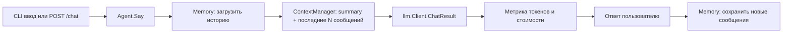

# План: неделя агента (папка `agent/`)

> Разбивка на дни не актуальна — это единая недельная работа в одной папке `agent/`.
> Каждый «день» из задания превращается в **этап**, который добавляет слой поверх
> уже существующего агента. Итог — самодостаточный модуль с наращиваемой логикой.

## Принципы

- Переиспользуем общий пакет [`llm`](../llm/llm.go) (клиент, `.env`-каскад, метрики токенов)
  по той же схеме, что и остальные дни: свой `go.mod` + `replace aichallenge/llm => ../llm`.
- Только стандартная библиотека Go (философия репозитория).
- Агент — отдельная сущность `Agent`, инкапсулирующая: память (историю) + вызов LLM + учёт токенов + сжатие.
- Каждый этап оставляет рабочее состояние: в конце этапа всё компилируется и запускается.

## Архитектура модуля `agent/` (гибрид)

Ядро агента — отдельный пакет `agent`, не зависящий от UI. Сверху два фронтенда,
оба вызывают одно и то же ядро: CLI (REPL-чат) и опциональный web (HTTP-сервер +
простая HTML-страница).

```
agent/
├── go.mod            # module agent; require aichallenge/llm; replace ../llm
├── agent.go          # пакет agent (ЯДРО): тип Agent, Say() инкапсулирует запрос→LLM→ответ, память и политику контекста
├── memory.go         # интерфейс Memory + реализация SQLiteMemory (база истории) — с Этапа 2
├── tokens.go         # оценка токенов (эвристика), расчёт стоимости, агрегация UsageStats
├── compress.go       # ContextManager: последние N "как есть", старшее → summary отдельно
├── config.go         # чтение config.json
├── config.json       # keep_last, summarize_after, history_file, model и т.п.
├── cmd/
│   ├── cli/main.go   # ФРОНТЕНД CLI: REPL-чат из stdin, флаги --reset/--stats/--compress, /exit
│   └── web/main.go   # ФРОНТЕНД Web (опционально): HTTP-сервер + статика, вызывает то же ядро
├── web/index.html    # простая страница чата для web-интерфейса
├── Makefile          # run / run-web / build / reset-history / demo
├── README.md         # описание этапов и команд
└── demo/demo.sh      # демо-прогон (см. skill record-demo)
```

Поток запроса (после всех этапов); верхний блок — точка входа зависит от выбранного фронтенда:



## Этап 1 — Первый агент (бывший День 6)

Цель: простой агент как отдельная сущность, а не «один вызов API».

- Каркас модуля `agent/`: `go.mod` с `replace` на `../llm`.
- Тип `Agent` (в `agent.go`): хранит `*llm.Client` и срез сообщений; метод
  `Say(input string)` инкапсулирует: добавить user-сообщение → `client.Chat(messages)` →
  добавить assistant-ответ → вернуть текст.
- **Без хранения**: на этом этапе память только в RAM, ничего не пишем на диск.
- `main.go`: REPL — читает строки из stdin, вызывает `agent.Say`, печатает ответ,
  выход по `exit`/Ctrl-D.
- `Makefile` (`run`, `build`), `README.md`.

Приёмка: агент принимает запрос и корректно вызывает LLM через API.

## Этап 2 — Сохранение контекста (бывший День 7)

Цель: история переживает перезапуск.

- `memory.go`: интерфейс `Memory { Open, Close, Load, Append, Reset }` —
  абстракция над хранилищем, чтобы среда выполнения не зависела от конкретной БД.
- Реализация `SQLiteMemory` — хранение `[]Message` (role, content, порядок) в SQLite
  (внешняя библиотека для драйвера; таблица `messages`).
- `Agent` держит ссылку на `Memory`; при старте открывает БД и загружает историю,
  после каждого хода сохраняет новые сообщения.
- Флаг `--reset` очищает историю; `main.go` поддерживает команду `/reset`.
- Проверка на практике: диалог → перезапуск → продолжение с восстановленной из SQLite памятью.

Приёмка: агент сохраняет и восстанавливает контекст между запусками.

## Этап 3 — Работа с токенами (бывший День 8)

Цель: считать токены запроса, всей истории и ответа; показать рост стоимости и поведение при переполнении.

- `tokens.go`:
  - `EstimateTokens(text)` — локальная эвристика (`len/4`, без внешних зависимостей),
    реальные значения берём из `llm.Result` (`PromptTokens`/`CompletionTokens`/`TotalTokens`).
  - Расчёт стоимости из `config.json` (цены за миллион токенов).
  - `UsageStats` — агрегатор по диалогу.
- `Agent.Say` возвращает метаданные (usage + стоимость), `main.go` выводит их под ответом.
- Режим `--stats`: сравнительная таблица короткий/длинный/переполненный диалог —
  показывает рост токенов/стоимости и что ломается при превышении лимита модели
  (имитируем длинной историей / низким `max_tokens`, фиксируем ошибку API).

Приёмка: код считает токены и показывает, как они влияют на поведение агента.

## Этап 4 — Сжатие истории (бывший День 9)

Цель: держать последние N сообщений «как есть», старшее сжимать в summary и подставлять его вместо полной истории.

- `compress.go`: `ContextManager`:
  - `keepLast` — сколько последних сообщений остаются сырыми;
  - `summarizeAfter` — когда остальное уходит в summary (например, каждые 10);
  - summary хранится отдельно в памяти/файле и подставляется в запрос системным сообщением.
  - Суммаризацию выполняет сама LLM (отдельный вызов со специальным промптом).
- `Agent.Say` при построении запроса вызывает `ContextManager.BuildMessages()`.
- Флаг `--compress on|off` + режим сравнения: качество и расход токенов до/после сжатия (таблица).

Приёмка: агент работает с компрессией и экономит токены.