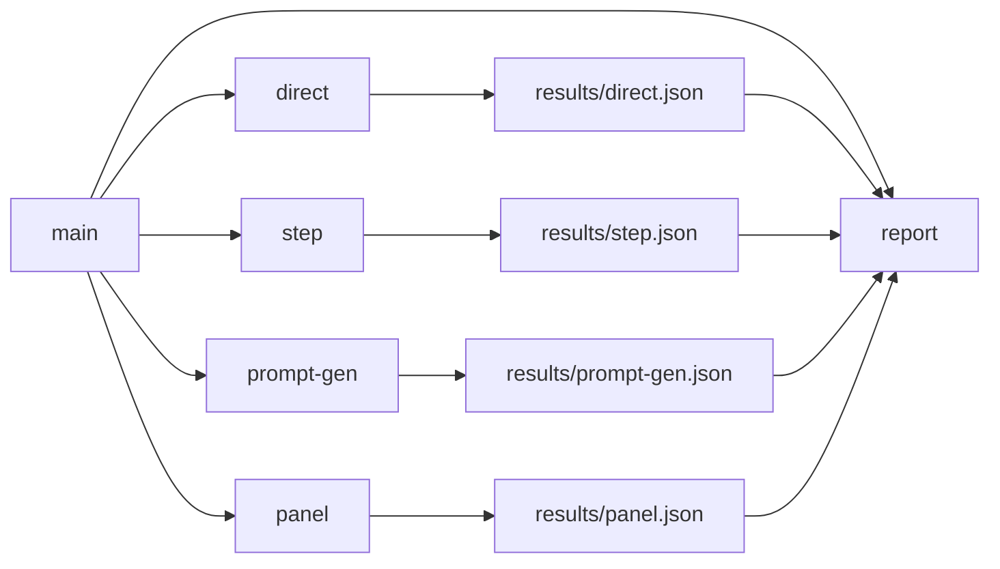

# Day 03 — Рефакторинг: параллельный запуск стратегий + отчёт

## Проблема

Сейчас `--run-all` гоняет 4 стратегии **в одном процессе последовательно** и падает
целиком при первом сетевом таймауте API-провайдера. Плюс весь код — в одном `main.go`,
а `--panel` не показывает диалог между ролями (все эксперты уходят одним запросом).

## Цель

1. Каждый способ — отдельный `.go` файл и отдельная команда.
2. Стратегии запускаются **параллельно** (не монолит): каждая пишет результат в свой JSON-файл.
3. JSON с результатами **не храним в git**.
4. `--panel` превращается в **последовательную передачу задачи между ролями**.
5. Вместо `--run-all` — команда **`report`**, которая читает JSON-файлы и строит статистику/сравнение.

## Архитектура

Единый бинарник `day_03`, диспетчеризация по подкоманде (первый аргумент).



### Файлы

| Файл            | Назначение                                                      |
|-----------------|-----------------------------------------------------------------|
| `main.go`       | Точка входа: парсинг подкоманды и диспетчеризация               |
| `task.go`       | `defaultTask` (задача про напитки)                              |
| `result.go`     | `Result`-структура + запись/чтение JSON                         |
| `direct.go`     | Стратегия «прямой ответ»                                        |
| `step.go`       | Стратегия «пошаговое решение»                                   |
| `promptgen.go`  | Стратегия «модель составляет промпт»                            |
| `panel.go`      | Панель экспертов с последовательной передачей между ролями      |
| `report.go`     | Чтение `results/*.json` + статистика/сравнение                  |
| `Makefile`      | Цели на каждый способ, `run-all` (параллель), `report`          |
| `.gitignore`    | Исключить `results/` и `bin/`                                   |

### CLI

- `day_03 direct` → `results/direct.json`
- `day_03 step` → `results/step.json`
- `day_03 prompt-gen` → `results/prompt-gen.json`
- `day_03 panel` → `results/panel.json`
- `day_03 report` → сравнение по собранным JSON

### Схема JSON результата

```json
{
  "method": "direct",
  "started_at": "2026-09-02T23:00:00+03:00",
  "finished_at": "2026-09-02T23:00:03+03:00",
  "duration_ms": 3120,
  "ok": true,
  "error": "",
  "result": "<raw текст модели>",
  "combos_found": 2,
  "combos": ["кофе 3, чай 2, какао 0", "кофе 0, чай 0, какао 5"]
}
```

- `combos`/`combos_found` извлекаются общим парсером (по строкам с тремя напитками).
- `result.go` содержит общие helper'ы: `writeJSON(path, Result)`, `loadResults(dir) []Result`.

### `panel` — последовательная передача между ролями

Четыре вызова API подряд, каждый следующий видит вывод предыдущих (видно в консоли):

1. **Аналитик** — формулирует уравнения и ограничения (x+y+z=5, 200x+150y+180z=900).
2. **Инженер** — предлагает конкретный алгоритм перебора и применяет его.
3. **Критик** — проверяет каждую комбинацию и ищет пропущенные.
4. **Итог** — координатор сводит финальный список всех комбинаций в формате `(кофе, чай, какао)`.

Консоль печатает секции `— Аналитик —`, `— Инженер —`, `— Критик —`, `— Итоговый список —`.

### `report` — статистика

- Таблица: `метод | ok | время | комбинаций найдено`.
- Группировка ответов по нормализованному набору комбинаций: сколько способов дали одинаковый ответ.
- Консенсус/вердикт: какой ответ преобладает, какие методы нашли полный набор.

### Makefile

- `run-direct`, `run-step`, `run-prompt-gen`, `run-panel` — отдельные команды.
- `run-all` — собирает бинарник и запускает 4 процесса **параллельно в фоне** (`&`), затем `wait`; каждая пишет свой JSON независимо (таймаут одного не рушит остальных).
- `report` — `go run . report`.

### git

- Создать `day_03/.gitignore`: `results/`, `bin/`, `*.json` в `results/`.